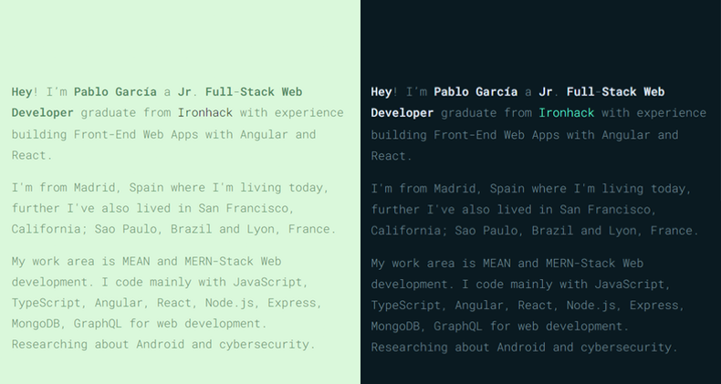

# pablogarcia.dev
_My personal website. A simple presentation card._


[pablogarcia.dev](https://pablogarcia.dev/)


## Created with HTML5, CSS3, Vanilla JavaScript and 💛



### Features

- Loads as fast as possible.
- Great coverage rate in the use of resources.
- Responsive web design, mobile first.
- All the content is flexible. to scale all the content of the website just change one CSS variable, the body font size `--font-size-base`.
- The font size change depending on the space it has available, it will be bigger when it has more space, and on the contrary, it will be smaller when less space is available.
- On `<address>` is calculated by CSS the browser height to always display it in full screen on all devices.
- The layout styles changes depending on the hour of the day that is accessed. From the 8h until the 20h is rendered `at-day` class on body tag, for the other hours is rendered `at-night` class.
- To manage both layouts are using CSS native variables, `var(some-property)`, in the same way as SCSS or SASS but with pure CSS3.
- All contents that have `title` attribute will generate a pop up with the text attribute to show more information about, if you want to change this info only need to modify the `title` attribute on HTML.
- SEO optimized.


### Performance

Google page speed test results:

[developers.google.com/pagespeed/pablogarcia.dev](https://developers.google.com/speed/pagespeed/insights/?url=https%3A%2F%2Fpablogarcia.dev&tab=mobile)
- 99% Mobile
- 100% Desktop


### Run task [optional]
This website using [Gulp.js](https://gulpjs.com/) to manage the run task like minify the JS and the CSS files. The dependencies that are using on the `package.json`:

```
"devDependencies": {
  "gulp": "^4.0.0",
  "gulp-minify": "^3.1.0",
  "gulp-clean-css": "^4.0.0",
  "gulp-rename": "^1.4.0"
}
```

In the App folder are the development files to work with Gulp. The public minify files are on Src folder, `index.html` calls these public files.

Check the `gulpfile.js` file on root for more info.


### Hey! support me

If you want to have your own site version, feel free to fork it and go ahead! 🙂

Cheers!
